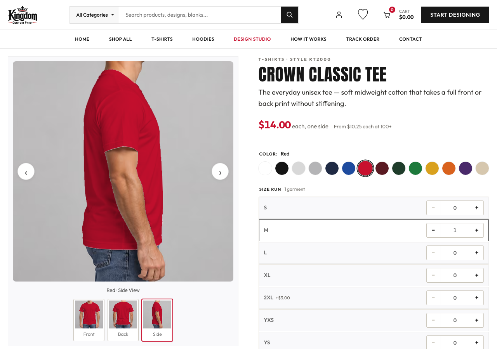
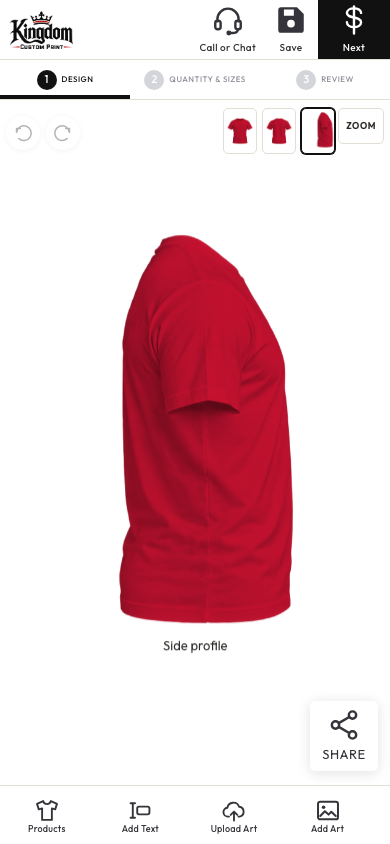

# Product gallery and customization review

Cards and product pages now share on-model apparel photography with visible necks and hands. Swatches recolor the fabric to the catalog color across all three angles, and selected colors carry into the customizer. The customizer uses isolated garment previews and a separate side profile; switching views preserves front and back artwork. An explicit product color takes precedence over a saved draft's color while retaining its artwork.

The gallery follows the front, back, and side presentation inspected on [RushOrderTees' Classic Tee page](https://www.rushordertees.com/catalog/rt/classic-tee/). Eight apparel families use original generated photography. Accessories have native side illustrations. Vector fabric outlines preserve skin, background, and garment shadows; isolated preview routes validate parameters and include the required assets in serverless deployment bundles.

Validation includes lint, TypeScript, production build, all 19 products and 170 color selections, gallery arrows, mobile layouts, color handoff, saved artwork, storefront controls, and cart flow. Earlier full route and customizer audits also passed. Stripe credentials remain deferred at the user's request, so checkout continues requiring payment configuration before accepting orders.

